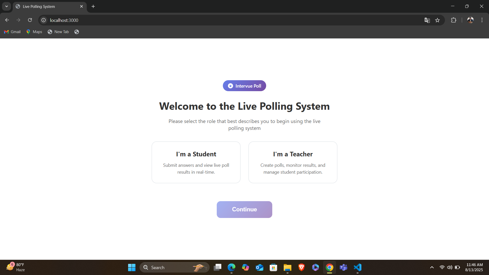
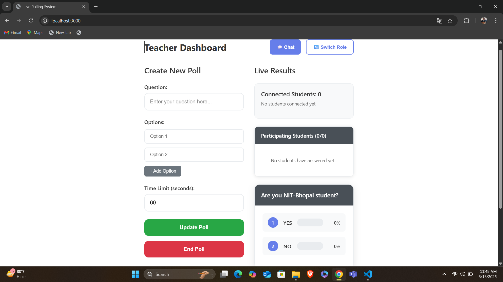
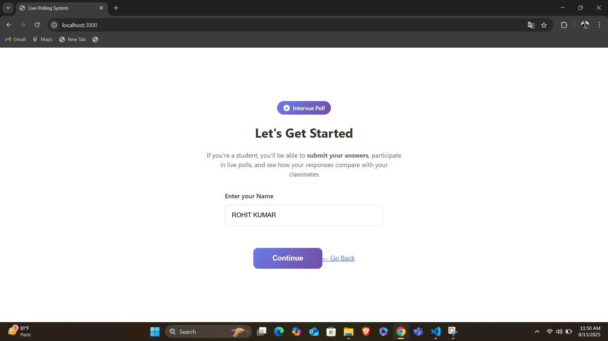
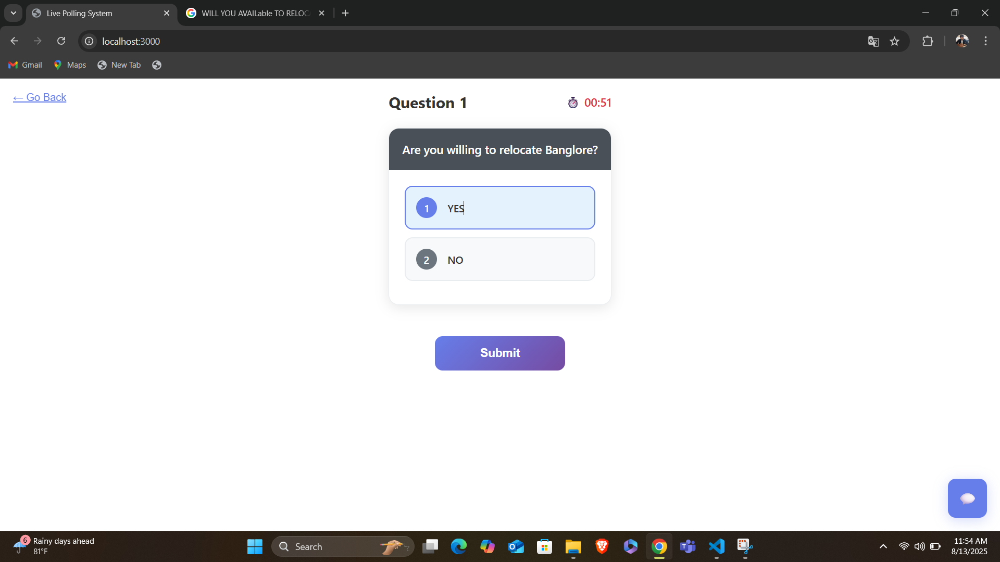
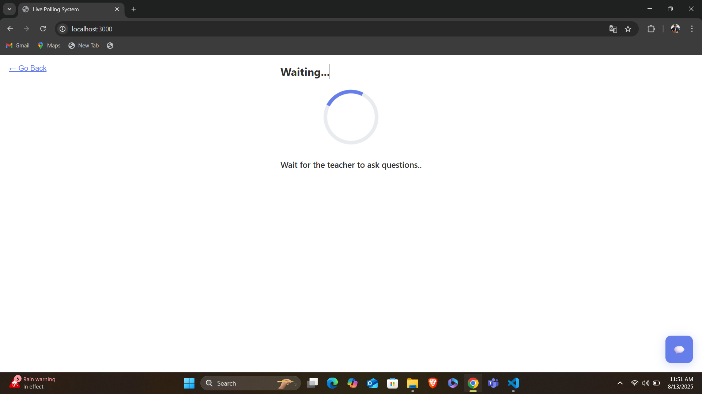
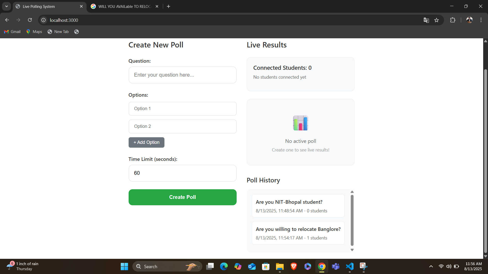
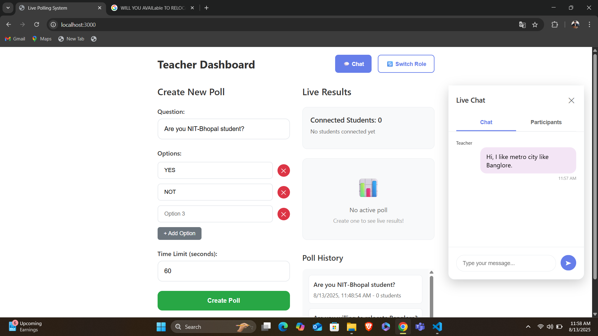

# Live Polling System

A real-time polling system built with React frontend and Express.js backend with Socket.io for live communication between teachers and students.

## Features

### Teacher Features
- ✅ Create new polls with custom questions and multiple options
- ✅ View live polling results in real-time
- ✅ Configurable poll time limits (10-300 seconds)
- ✅ Ask new questions only when all students have answered or no question is active
- ✅ View poll history
- ✅ Remove students from the session
- ✅ Live chat with students

### Student Features
- ✅ Enter unique name on first visit
- ✅ Submit answers to active polls
- ✅ View live polling results after submission
- ✅ 60-second countdown timer (configurable by teacher)
- ✅ Live chat with teachers and other students

### Technical Features
- ✅ Real-time communication using Socket.io
- ✅ Responsive design for mobile and desktop
- ✅ Modern UI with gradient backgrounds and smooth animations
- ✅ Auto-submission when time runs out
- ✅ Persistent session management


## Technology Stack

- **Frontend**: React 18 with modern hooks
- **Backend**: Express.js with Socket.io
- **Real-time Communication**: Socket.io
- **Styling**: CSS3 with modern design patterns
- **Package Management**: npm

## Installation & Setup

### Prerequisites
- Node.js (v14 or higher)
- npm (v6 or higher)

### Quick Start

1. **Clone and install dependencies:**
   ```bash
   git clone <repository-url>
   cd polling_system
   npm run install-all
   ```

2. **Start the development servers:**
   ```bash
   npm run dev
   ```

   This will start both:
   - Backend server on `http://localhost:5000`
   - Frontend React app on `http://localhost:3000`

### Manual Setup

If you prefer to run services separately:

1. **Install root dependencies:**
   ```bash
   npm install
   ```

2. **Install and start backend:**
   ```bash
   cd backend
   npm install
   npm run dev
   ```

3. **Install and start frontend (in a new terminal):**
   ```bash
   cd frontend
   npm install
   npm start
   ```

## Usage

### For Teachers
1. Open the application and select "I`m a Teacher"
2. Create a new poll by entering a question and multiple options
3. Set a time limit for the poll
4. Click "Create Poll" to start the session
5. Monitor live results as students answer
6. Use the chat feature to communicate with students
7. End the poll manually or wait for the timer to expire


### For Students
1. Open the application and select "I`m a Student"
2. Enter your name to join the session
3. Wait for the teacher to create a poll
4. Select your answer from the provided options
5. Submit your answer before the timer expires
6. View live results after submission
7. Use the chat feature to communicate with teachers and other students




## API Endpoints

- `GET /api/poll-status` - Get current poll status and student count
- `GET /api/poll-history` - Get history of completed polls

## Socket Events



### Client to Server
- `student-join` - Student joins the session
- `create-poll` - Teacher creates a new poll
- `submit-answer` - Student submits an answer
- `end-poll` - Teacher ends the current poll
- `remove-student` - Teacher removes a student
- `chat-message` - Send a chat message

### Server to Client
- `poll-active` - New poll is created
- `poll-results-update` - Poll results are updated
- `poll-ended` - Poll has ended
- `student-count-update` - Student count has changed
- `removed-by-teacher` - Student has been removed
- `chat-message` - New chat message received


## Project Structure

```
polling_system/
├── backend/                 # Express.js server
│   ├── package.json
│   └── server.js          # Main server file with Socket.io
├── frontend/               # React application
│   ├── public/
│   │   └── index.html
│   ├── src/
│   │   ├── components/
│   │   │   ├── TeacherView.js
│   │   │   ├── StudentView.js
│   │   │   └── ChatPopup.js
│   │   ├── App.js
│   │   ├── App.css
│   │   ├── index.js
│   │   └── index.css
│   └── package.json
├── package.json            # Root package.json
└── README.md
```

## Deployment

### Backend Deployment
The backend can be deployed to any Node.js hosting service (Heroku, Railway, Render, etc.) by:
1. Setting the `PORT` environment variable
2. Updating the CORS origin in `server.js` to match your frontend domain

### Frontend Deployment
The React frontend can be deployed to any static hosting service (Netlify, Vercel, GitHub Pages, etc.) by:
1. Building the project: `npm run build`
2. Deploying the `build` folder
3. Updating the backend URL in the Socket.io connection

## Contributing

1. Fork the repository
2. Create a feature branch
3. Make your changes
4. Test thoroughly
5. Submit a pull request

## License

MIT License - see LICENSE file for details

## Support

For issues and questions, please open an issue in the repository.


